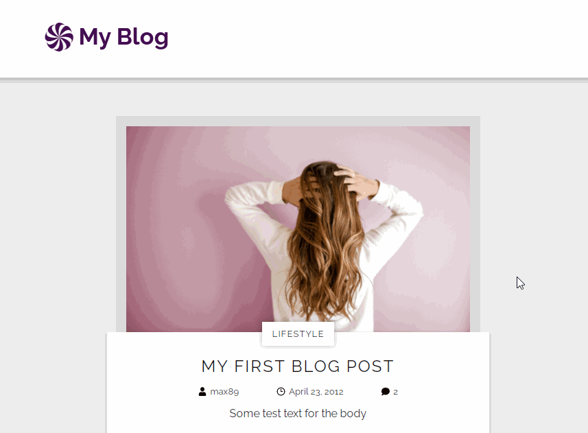

# Designing a blog with React, JSON-Server and Markdown

A React application to practice styling a simple blog. I used JSON-Server for saving the information of the different blog entries. I used some small styling techniques like a shrinking header on scroll and media queries. I didn't used an environment like *Create React App*, i created a Node project from the ground up and configured the webpack bundler myself.

## Modules used

### General
- React 17.0.2
- Webpack 5.46.0
- React Router Dom 5.2.0
- React Markdown 6.0.3

### Webpack Loader
- Html Loader
- File Loader
- Style Loader
- Postcss Loader
- Css Loader

## Assets used

### Images
- [Lighthouse] // Photo by Quaid Lagan on Unsplash
- [Stockphoto Woman] // Photo by Element5 Digital on Unsplash
- [Coffee Table] // Photo by Danielle MacInnes on Unsplash

## Problem with Markdown

I experienced a problem with my markdown files and the images inside the files. The idea is when I wanna see the blog content which is a markdown file, i fetch it inside useEffect with the file attribute from the db.json. The problem is that it won't load the markdown file inside the component, but if I import the markdown file then he will use it. The same thing also happens with the images inside the markdown file, only when I also import them they will show up. Therefore I created a component named *Images* at **./src/config/Images.js** where I only import all the files I need even if I never use them. I need to figure out how to load the files and images dynamically.

## Future plans

- Add user authorization and authentication. Probably will build a server with graphql for that.
- Every user gets a role and an add a blog entry and comment on different blog entries.
- Create a Form that transform the content into a markdown file
- Edit and delete blog entries and comments

## Preview

